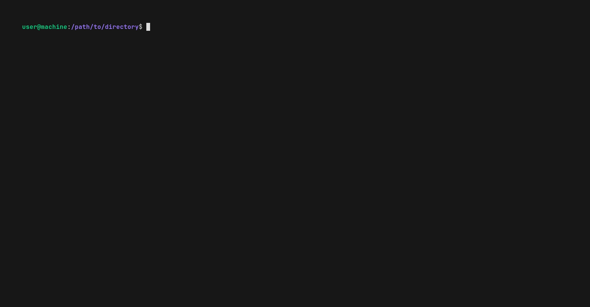

<!--

WARNING: This file is auto-generated by snipinator. Do not edit directly.
SOURCE: `README.md.jinja2`.

-->
<!--


-->

# <div align="center">![mdreftidy][1]</div>

<div align="center">

</div>

<div align="center">

<!-- Icons from https://lucide.dev/icons/users -->
<!-- Icons from https://lucide.dev/icons/laptop-minimal -->

![**Audience:** Developers][2] ![**Platform:** Linux][3]

</div>

<p align="center">
  <strong>
    <a href="#-features">🎇Features</a>
    &nbsp;&bull;&nbsp;
    <a href="#-installation">🏠Installation</a>
    &nbsp;&bull;&nbsp;
    <a href="#-usage">🚜Usage</a>
    &nbsp;&bull;&nbsp;
    <a href="#-command-line-options">💻CLI</a>
    &nbsp;&bull;&nbsp;
    <a href="#-examples">💡Examples</a>
    &nbsp;&bull;&nbsp;
    <a href="#-requirements">✅Requirements</a>
  </strong>
</p>

<div align="center">

![Top language][4] [![GitHub License][5]][6] [![PyPI - Version][7]][8]
[![Python Version][9]][8]

**CLI to tidy ({renumber,move-to-bottom,sort,clean}) up {image,link} references
for markdown**

</div>

---

<div align="center">

|                   | Status                      | Stable                    | Unstable                  |                    |
| ----------------- | --------------------------- | ------------------------- | ------------------------- | ------------------ |
| **[Master][10]**  | [![Build and Test][11]][12] | [![since tagged][13]][14] |                           | ![last commit][15] |
| **[Develop][16]** | [![Build and Test][17]][12] | [![since tagged][18]][19] | [![since tagged][20]][21] | ![last commit][22] |

</div>



## ❔ What

What mdreftidy does:

Turn this ([./mdreftidy/examples/EXAMPLE.md](./mdreftidy/examples/EXAMPLE.md)):

<!---->
```md
# Example markdown file

## Reference link: Out of order

[Reference link: Out of order 1][3], [Reference link: Out of order 2][2].

[2]: ./reference-link-out-of-order-2

## Footnotes

[6]: ./unused-reference-link-6
[3]: ./reference-link-out-of-order-3
[1]: ./unused-reference-link-1

```
<!---->

Into this
([./mdreftidy/examples/EXAMPLE.all-opts.tidied.md](./mdreftidy/examples/EXAMPLE.all-opts.tidied.md)):

<!---->
```md
# Example markdown file

## Reference link: Out of order

[Reference link: Out of order 1][1], [Reference link: Out of order 2][2].


## Footnotes

[1]: ./reference-link-out-of-order-3
[2]: ./reference-link-out-of-order-2

```
<!---->

This is useful for uploading `README.md` files to third-party sites, like the
npmjs.com registry, or pypi.org registry, because these registries will break
the local images in your README when displayed on their sites.

## 🎇 Features

- Renumbers references by order used.
- Optionally removes unused references.
- Optionally moves references to the bottom.
- Optionally sorts reference blocks.

## 🏠 Installation

```bash
# Install from pypi (https://pypi.org/project/mdreftidy/)
pip install mdreftidy

# Install from git (https://github.com/realazthat/mdreftidy)
pip install git+https://github.com/realazthat/mdreftidy.git@v0.3.0
```

## 🚜 Usage

Example README: ([./mdreftidy/examples/EXAMPLE.md](./mdreftidy/examples/EXAMPLE.md)):

<!---->
```md
# Example markdown file

## Reference link: Out of order

[Reference link: Out of order 1][3], [Reference link: Out of order 2][2].

[2]: ./reference-link-out-of-order-2

## Footnotes

[6]: ./unused-reference-link-6
[3]: ./reference-link-out-of-order-3
[1]: ./unused-reference-link-1

```
<!---->

Generating the README:

<!---->
```bash
$ python -m mdreftidy.cli ./mdreftidy/examples/EXAMPLE.md --move-to-bottom --remove-unused --sort-ref-blocks --renumber -o - 2>/dev/null
# Example markdown file

## Reference link: Out of order

[Reference link: Out of order 1][1], [Reference link: Out of order 2][2].


## Footnotes

[1]: ./reference-link-out-of-order-3
[2]: ./reference-link-out-of-order-2

```
<!---->

## 💻 Command Line Options

<!---->

<!---->

## 💡 Examples

- Example:
  - Original: [./mdreftidy/examples/EXAMPLE.md](./mdreftidy/examples/EXAMPLE.md).
  - Tidied:
    [./mdreftidy/examples/EXAMPLE.all-opts.tidied.md](./mdreftidy/examples/EXAMPLE.all-opts.tidied.md).
  - Generation script: [./mdreftidy/examples/example.sh](./mdreftidy/examples/example.sh).

<!-- TODO: Rebuild this for mdreftidy
- Projects using mdreftidy:
  - [realazthat/snipinator](https://github.com/realazthat/snipinator), See
    [snipinator/README.md.jinja2](https://github.com/realazthat/snipinator/blob/61cb88593baa099dc375cf5fd40679e4be673fc5/README.md.jinja2).
  - [github.com/realazthat/changeguard](https://github.com/realazthat/changeguard),
    See
    [changeguard/README.md.jinja2](https://github.com/realazthat/changeguard/blob/87d5104b52e651bb9195a3d46dd7f050acbcb534/README.md.jinja2).
  - [github.com/realazthat/comfy-catapult](https://github.com/realazthat/comfy-catapult),
    See
    [comfy-catapult/README.md.jinja2](https://github.com/realazthat/comfy-catapult/blob/ff353d48b25fa7b9c35fa11b31d5f2b3039c41c8/README.md.jinja2).
  - [github.com/realazthat/comfylowda](https://github.com/realazthat/comfylowda),
    See
    [comfylowda/README.md.jinja2](https://github.com/realazthat/comfylowda/blob/e01a32c38107aa0b89ccea21c4678d193a186a78/README.md.jinja2).
  - [github.com/realazthat/excalidraw-brute-export-cli](https://github.com/realazthat/excalidraw-brute-export-cli),
    See
    [excalidraw-brute-export-cli/README.md.jinja2](https://github.com/realazthat/excalidraw-brute-export-cli/blob/54a3b5b08b644e61c721ab565c576094234c5cc7/README.md.jinja2).
-->

## ✅ Requirements

- Linux-like environment
  - Why: Uses pexpect.spawn().
- Python 3.8+
  - Why: Some dev dependencies require Python 3.8+.

### Tested Platforms

- WSL2 Ubuntu 20.04, Python `3.8.0`.
- Ubuntu 20.04, Python `3.8.0, 3.9.0, 3.10.0, 3.11.0, 3.12.0`, tested in GitHub Actions
  workflow ([build-and-test.yml](./.github/workflows/build-and-test.yml)).

## 🤏 Versioning

We use SemVer for versioning. For the versions available, see the tags on this
repository.

## 🔑 License

This project is licensed under the MIT License - see the
[./LICENSE.md](./LICENSE.md) file for details.

## 🙏 Thanks

Main libraries used in mdreftidy are:

- Markdown AST: [mistletoe](https://github.com/miyuchina/mistletoe).
- Colorful CLI help: [rich-argparse](https://github.com/hamdanal/rich-argparse).

## 🤝 Related Projects

Not complete, and not necessarily up to date. Make a PR
([contributions](#-contributions)) to insert/modify.

| Project           | Stars | Last Update  | Language | Platform | Similarity X Obviousness |
| ----------------- | ----- | ------------ | -------- | -------- | ------------------------ |
| [dce/mdrenum][60] | 2     | `2023/11/16` | JS       | CLI      | ⭐⭐⭐⭐⭐               |

## 🫡 Contributions

### Development environment: Linux-like

- For running `pre.sh` (Linux-like environment).

  - From [./.github/dependencies.yml](./.github/dependencies.yml), which is used for
    the GH Action to do a fresh install of everything:

    ```yaml
    bash: scripts.
    findutils: scripts.
    grep: tests.
    xxd: tests.
    git: scripts, tests.
    xxhash: scripts (changeguard).
    rsync: out-of-directory test.
    expect: for `unbuffer`, useful to grab and compare ansi color symbols.
    jq: dependency for [yq](https://github.com/kislyuk/yq), which is used to generate
      the README; the README generator needs to use `tomlq` (which is a part of `yq`)
      to query `pyproject.toml`.
    
    ```

  - Requires `pyenv`, or an exact matching version of python as in
    [.python-version](.python-version) (which is currently
    `3.8.0
`).
  - `jq`, ([installation](https://jqlang.github.io/jq/)) required for
    [yq](https://github.com/kislyuk/yq), which is itself required for our
    [./README.md](./README.md) generation, which uses `tomlq` (from the
    [yq](https://github.com/kislyuk/yq) package) to include version strings from
    [./pyproject.toml](./pyproject.toml).
  - act (to run the GH Action locally):
    - Requires nodejs.
    - Requires Go.
    - docker.
  - Generate animation:
    - docker

### Commit Process

1. (Optionally) Fork the `develop` branch.
2. Stage your files: `git add path/to/file.py`.
3. `bash ./scripts/pre.sh`, this will format, lint, and test the code.
4. `git status` check if anything changed (generated
   [./README.md](./README.md) for example), if so, `git add` the
   changes, and go back to the previous step.
5. `git commit -m "..."`.
6. Make a PR to `develop` (or push to develop if you have the rights).

## 🔄🚀 Release Process

These instructions are for maintainers of the project.

1. In the `develop` branch, run `bash ./scripts/pre.sh` to ensure
   everything is in order.
2. In the `develop` branch, bump the version in
   [./pyproject.toml](./pyproject.toml), following semantic versioning
   principles. Also modify the `last_unstable_release` and `last_stable_release`
   in the `[tool.mdreftidy-project-metadata]` table as appropriate. Run
   `bash ./scripts/pre.sh` to ensure everything is in order.
3. In the `develop` branch, commit these changes with a message like
   `"Prepare release X.Y.Z"`. (See the contributions section
   [above](#commit-process)).
4. Merge the `develop` branch into the `master` branch:
   `git checkout master && git merge develop --no-ff`.
5. `master` branch: Tag the release: Create a git tag for the release with
   `git tag -a vX.Y.Z -m "Version X.Y.Z"`.
6. Publish to PyPI: Publish the release to PyPI with
   `bash ./scripts/deploy-to-pypi.sh`.
7. Push to GitHub: Push the commit and tags to GitHub with
   `git push && git push --tags`.
8. The `--no-ff` option adds a commit to the master branch for the merge, so
   refork the develop branch from the master branch:
   `git checkout develop && git merge master`.
9. Push the develop branch to GitHub: `git push origin develop`.

<!-- Logo from https://lucide.dev/icons/users -->

<!-- Logo from https://lucide.dev/icons/laptop-minimal -->

[1]: ./.github/logo-exported.svg
[2]:
  https://img.shields.io/badge/Audience-Developers-0A1E1E?style=plastic&logo=data:image/svg+xml;base64,PHN2ZyB4bWxucz0iaHR0cDovL3d3dy53My5vcmcvMjAwMC9zdmciIHdpZHRoPSIyNCIgaGVpZ2h0PSIyNCIgdmlld0JveD0iMCAwIDI0IDI0IiBmaWxsPSJub25lIiBzdHJva2U9ImN1cnJlbnRDb2xvciIgc3Ryb2tlLXdpZHRoPSIyIiBzdHJva2UtbGluZWNhcD0icm91bmQiIHN0cm9rZS1saW5lam9pbj0icm91bmQiIGNsYXNzPSJsdWNpZGUgbHVjaWRlLXVzZXJzIj48cGF0aCBkPSJNMTYgMjF2LTJhNCA0IDAgMCAwLTQtNEg2YTQgNCAwIDAgMC00IDR2MiIvPjxjaXJjbGUgY3g9IjkiIGN5PSI3IiByPSI0Ii8+PHBhdGggZD0iTTIyIDIxdi0yYTQgNCAwIDAgMC0zLTMuODciLz48cGF0aCBkPSJNMTYgMy4xM2E0IDQgMCAwIDEgMCA3Ljc1Ii8+PC9zdmc+
[3]:
  https://img.shields.io/badge/Platform-Linux-0A1E1E?style=plastic&logo=data:image/svg+xml;base64,PHN2ZyB4bWxucz0iaHR0cDovL3d3dy53My5vcmcvMjAwMC9zdmciIHdpZHRoPSIyNCIgaGVpZ2h0PSIyNCIgdmlld0JveD0iMCAwIDI0IDI0IiBmaWxsPSJub25lIiBzdHJva2U9ImN1cnJlbnRDb2xvciIgc3Ryb2tlLXdpZHRoPSIyIiBzdHJva2UtbGluZWNhcD0icm91bmQiIHN0cm9rZS1saW5lam9pbj0icm91bmQiIGNsYXNzPSJsdWNpZGUgbHVjaWRlLWxhcHRvcC1taW5pbWFsIj48cmVjdCB3aWR0aD0iMTgiIGhlaWdodD0iMTIiIHg9IjMiIHk9IjQiIHJ4PSIyIiByeT0iMiIvPjxsaW5lIHgxPSIyIiB4Mj0iMjIiIHkxPSIyMCIgeTI9IjIwIi8+PC9zdmc+
[4]:
  https://img.shields.io/github/languages/top/realazthat/mdreftidy.svg?&cacheSeconds=28800&style=plastic&color=0A1E1E
[5]:
  https://img.shields.io/github/license/realazthat/mdreftidy?style=plastic&color=0A1E1E
[6]: ./LICENSE.md
[7]:
  https://img.shields.io/pypi/v/mdreftidy?style=plastic&color=0A1E1E
[8]: https://pypi.org/project/mdreftidy/
[9]:
  https://img.shields.io/pypi/pyversions/mdreftidy?style=plastic&color=0A1E1E
[10]: https://github.com/realazthat/mdreftidy/tree/master
[11]:
  https://img.shields.io/github/actions/workflow/status/realazthat/mdreftidy/build-and-test.yml?branch=master&style=plastic
[12]:
  https://github.com/realazthat/mdreftidy/actions/workflows/build-and-test.yml
[13]:
  https://img.shields.io/github/commits-since/realazthat/mdreftidy/v0.3.0/master?style=plastic
[14]:
  https://github.com/realazthat/mdreftidy/compare/v0.3.0...master
[15]:
  https://img.shields.io/github/last-commit/realazthat/mdreftidy/master?style=plastic
[16]: https://github.com/realazthat/mdreftidy/tree/develop
[17]:
  https://img.shields.io/github/actions/workflow/status/realazthat/mdreftidy/build-and-test.yml?branch=develop&style=plastic
[18]:
  https://img.shields.io/github/commits-since/realazthat/mdreftidy/v0.3.0/develop?style=plastic
[19]:
  https://github.com/realazthat/mdreftidy/compare/v0.3.0...develop
[20]:
  https://img.shields.io/github/commits-since/realazthat/mdreftidy/v0.3.0/develop?style=plastic
[21]:
  https://github.com/realazthat/mdreftidy/compare/v0.3.0...develop
[22]:
  https://img.shields.io/github/last-commit/realazthat/mdreftidy/develop?style=plastic
